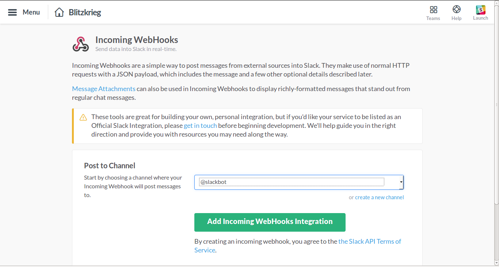
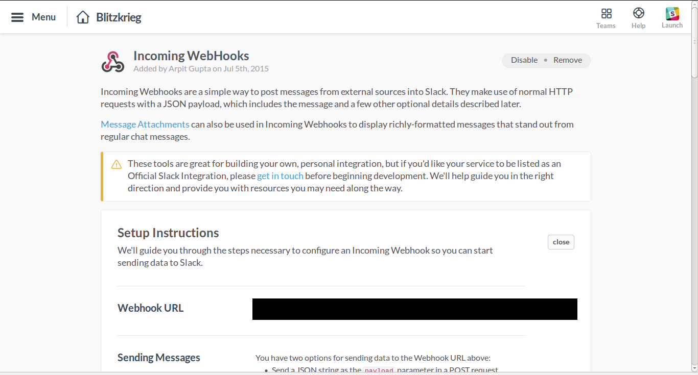
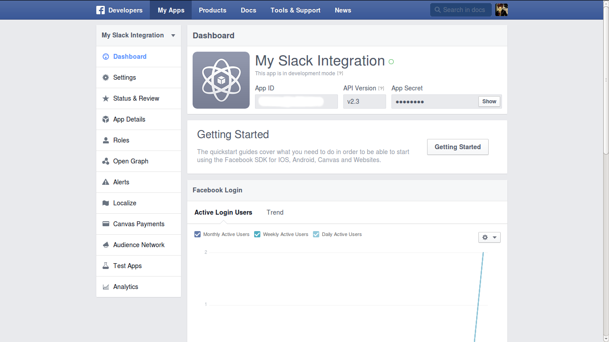
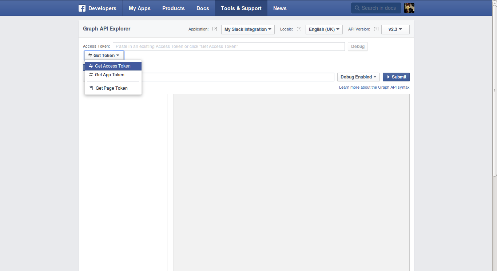

## Facebook-Slack-Integration

Purpose of this integration is to receive a message on Slack for new Notifications and Messages received on Facebook.

## Installing Facebook-Slack-Integration for your slack

1. Obtaining Slack Incoming Webhook url:
	* Go to `https://<your-team-name>.slack.com/services/new/incoming-webhook`.
	* Choose `@slackbot` as channel and add Incoming Webhook Integration.
	
	* Copy the Webhook URL and enter it as `slack_url` in config variables at deployment stage.
	* Customize the webhook with your favorite name and icon (Facebook Favicon included) and save.
	

2. Obtaining Facebook App ID and App Secret:
	* Go to [Facebook Developers](https://developers.facebook.com/quickstarts/?platform=web) and register.
	* Follow instructions and create a new web app. 
	* On you app's page, Copy the App ID and enter it as `app_id` in config variables at deployment stage.
	* Copy the App Secret and enter it as `app_secret` in config variables at deployment stage.
	
	
3. Obtaining Facebook User Access Token:
	* Go to [Facebook Graph Explorer Tool](https://developers.facebook.com/tools/explorer/).
	* Select your fb app in application dropdown and click 'get token' > 'get access token'.
	* Select `user_about_me` permission and from extended permissions select `manage_notifications` , `read_mailbox` , `read_stream`
	* Click `get access token` and enter the token generated as `access_token` in config variables  at deployment stage.
	

4. Deploying:
	* Deploy on [heroku](https://www.heroku.com/) by creating a [new app](https://dashboard.heroku.com/new).
	* Set config variables `slack_url` `app_id` `app_secret` `access_token` in the settings tab of your app.
	

	* Fork and clone this repository to you local. 
	* Add heroku remote to your local repo using the deploy instructions in the deploy tab of your heroku app.
	* Push to remote using command:  `git push heroku master`
	* Check `heroku ps` to confirm that you web is working otherwise run command to start your app: `heroku ps:scale web=1`

5. Keeping Active (for heroku deploys):
	* Heroku tends to kill the dyno if the app route is inactive for 30mins (may change). Hence, we will use one of the ping services available online. I chose [HerokuPing](http://www.herokuping.com/). 
	* Just submit your heroku app url there and it will ping your app every 10mins, firing up the facebook checking functions.
	

## Using Facebook-Slack-Integration with slack

After deploying, Facebook-Slack-Integration will keeping running as a background worker and checking new fb messages every time the app is pinged while checking new fb notifications every 6th time to keep you updated at your chosen slack channel for the webhook.

## Limitations

You will need to re-generate your facebook access token (step 3) every 2months. This is a restriction made by fb api for security reasons.

## Support or Contact

Having trouble with Facebook-Slack-Integration? Create an issue in the repository GitHub Repo.

